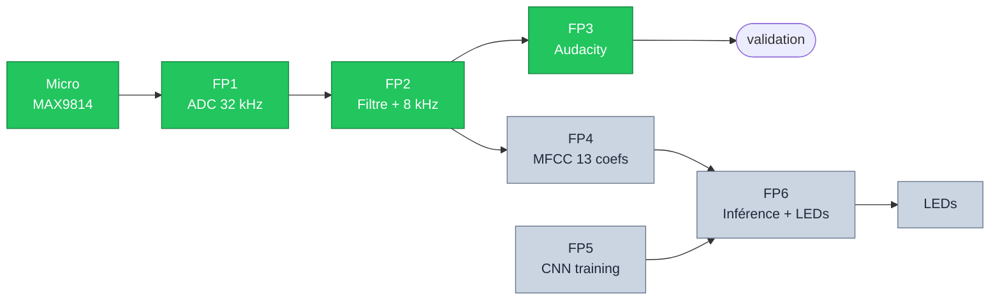

# Pipeline NeuralSpeech : 6 fonctions, 3 closes

 

**Soutenance 1 (aujourd'hui)** — ✓ FP1, FP2, FP3 
ET1, ET2, ET3, ET4 validées

**Soutenance 2** — FP4, FP5, FP6 
ET5, ET6, ET7, ET8, ET9 à venir

