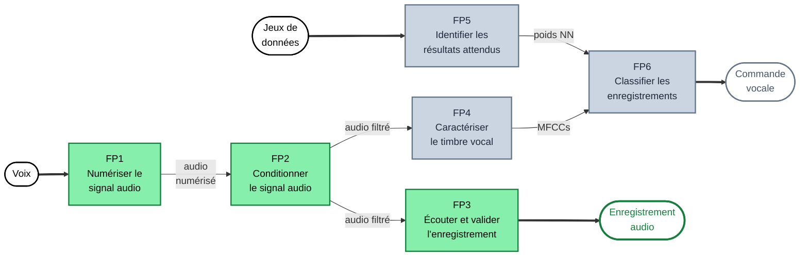

# Diagramme fonctionnel — 6 FP, 2 entrées, 2 sorties

**Soutenance 1 — chaîne validée (vert)**

✓ FP1 numérisation · ✓ FP2 conditionnement · ✓ FP3 écoute Audacity 
→ Sortie « Enregistrement audio » fonctionnelle (ET1 à ET4)

**Soutenance 2 — chaîne IA (gris)**

FP4 MFCC · FP5 training CNN Python · FP6 inférence + LEDs 
→ Sortie « Commande vocale » à venir (ET5 à ET9)

