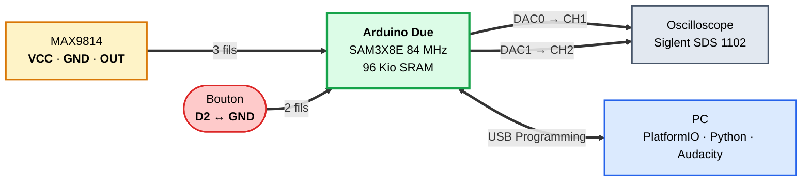

# Architecture matérielle : 4 fils + 1 bouton + 1 micro

**Pinout retenu (Arduino Due)**

| Broche | Fonction |
|--------|----------|
| **A0** | ADC entrée audio (MAX9814 OUT) |
| **D2** | Bouton FP3 (pull-up interne) |
| **DAC0** (pin 66) | Signal **brut** → CH1 oscillo |
| **DAC1** (pin 67) | Signal **filtré** → CH2 oscillo |

**Choix d'intégration**

- MAX9814 alimenté en **3,3 V** (Due *non* 5 V tolérante)
- Bouton **sans résistance externe** (`INPUT_PULLUP` interne)
- Aucun shield → câblage direct breadboard
- **Masse commune** Due ↔ GBF ↔ oscilloscope

