# Architecture logicielle : 3 buffers circulaires, 2 contextes

```mermaid {scale: 0.55}
flowchart LR
  ISR["TC0 ISR<br>32 kHz · ~1 µs"]:::isr -->|push| ADCBUF[("adcBuffer<br>512 × uint16<br>32 kHz")]:::buf
  ADCBUF -->|consume| LOOP["loop&#40;&#41;<br>main thread"]:::loop
  LOOP --> FILT["filter_sample&#40;&#41;<br>RIF 40 taps Q15<br>11 µs"]:::filt
  FILT --> DAC1[("DAC1<br>signal filtré")]:::out
  ADCBUF -.->|raw| DAC0[("DAC0<br>signal brut")]:::out
  FILT -->|décim /4| BUF8K[("buf8k<br>2048 × int16<br>8 kHz")]:::buf
  BTN([D2 IRQ poll]):::btn --> FSM{"FSM FP3<br>IDLE → ARMING<br>→ DUMPING"}:::fsm
  BUF8K --> FSM
  FSM --> CAPT[("captureBuffer<br>8000 × int16")]:::buf
  CAPT --> SER["Serial 250 k<br>magic + PCM"]:::out
  SER --> PY[Python fp3_recv.py]:::pc

  classDef isr fill:#fecaca,stroke:#dc2626,color:#000
  classDef loop fill:#bfdbfe,stroke:#2563eb,color:#000
  classDef filt fill:#d8b4fe,stroke:#7c3aed,color:#000
  classDef buf fill:#fef3c7,stroke:#d97706,color:#000
  classDef out fill:#bbf7d0,stroke:#16a34a,color:#000
  classDef btn fill:#fecaca,stroke:#dc2626,color:#000
  classDef fsm fill:#fde68a,stroke:#ca8a04,color:#000
  classDef pc fill:#e2e8f0,stroke:#475569,color:#000
```

**Pourquoi 3 buffers circulaires ?**

Chacun découple un couple producteur/consommateur :
1. ISR → loop (audio brut)
2. loop → loop (FIR delay line)
3. loop → FSM (audio filtré 8 kHz)

Tailles **puissance de 2** → modulo gratuit (`& mask`).

**Pourquoi filtrer dans `loop()` et non l'ISR ?**

- ISR doit rester **< 31,25 µs** (ET3)
- Filtre 40 taps Q15 ≈ 11 µs → tient en ISR mais alourdit la latence
- Loop a 32 cycles ISR de marge → prélève à son rythme
- Découplage strict : ISR = capture, loop = traitement

