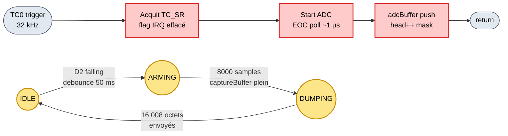

# Algorigramme : ISR TC0 + state machine FP3

**ISR TC0 — producteur 32 kHz**

ISR ultra-courte (~1 µs) : pas de calcul, juste lecture ADC + push buffer. Garantit Fe stable à 0,04 % d'erreur près.

**FSM FP3 — bouton D2**

Non bloquante : la chaîne FP1+FP2 continue de filtrer pendant ARMING (3 s de capture) et DUMPING (~0,64 s de transfert série).

