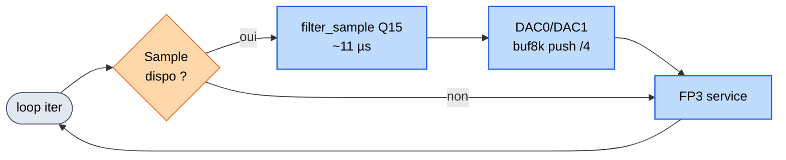

# Algorigramme : `loop()` — flux par échantillon

**3 étapes par échantillon (mode IDLE)**

1. **Sample dispo ?** — pop ADC buffer si oui
2. **Filtrage Q15** — 40 MAC en ~11 µs, sortie sur DAC0 (brut) et DAC1 (filtré), 1/4 → buf8k
3. **FP3 service** — polling bouton D2 + envoi série (1 octet/tour)

**Coût total &lt; 15 µs**

→ Largement sous le budget ET3 (31,25 µs / sample). 
→ La loop tourne plus vite que l'ISR ne produit. 
→ `buf_used = 0–1 / 512` en régime permanent : aucune perte d'échantillon.

