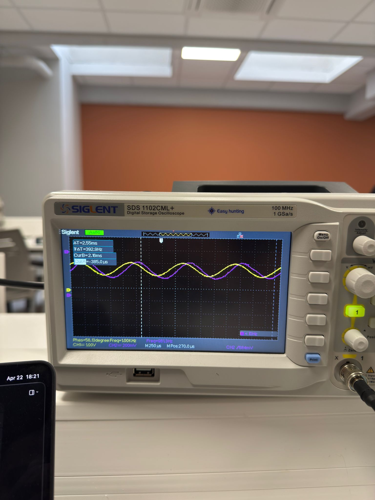

# ET1 validée : Fe = 32 012 Hz, stable

**3 preuves complémentaires :**

1. **Console série** — comptage des ISR sur 1 s

<div class="text-xs">

```
[FP1] Fe_reelle=32011 Hz | samples=32012 | buf_used=0/512
[FP1] Fe_reelle=32012 Hz | samples=32013 | buf_used=0/512
[FP1] Fe_reelle=32012 Hz | samples=32013 | buf_used=1/512
```

</div>

→ Te = 1 / 32 012 = **31,238 µs**

<br>

2. **Reconstruction oscillo** — sinus 1 kHz<br>
   CH1 (entrée) ≡ CH2 (DAC0)

3. **Buffer non saturé** — `buf_used = 0–1 / 512`<br>
   La loop consomme plus vite que l'ISR ne produit.

::right::



<div class="text-xs opacity-70 text-center mt-2">
Sinus 1 kHz injectée sur A0 (CH1) <br>
reconstruite proprement sur DAC0 (CH2)
</div>
