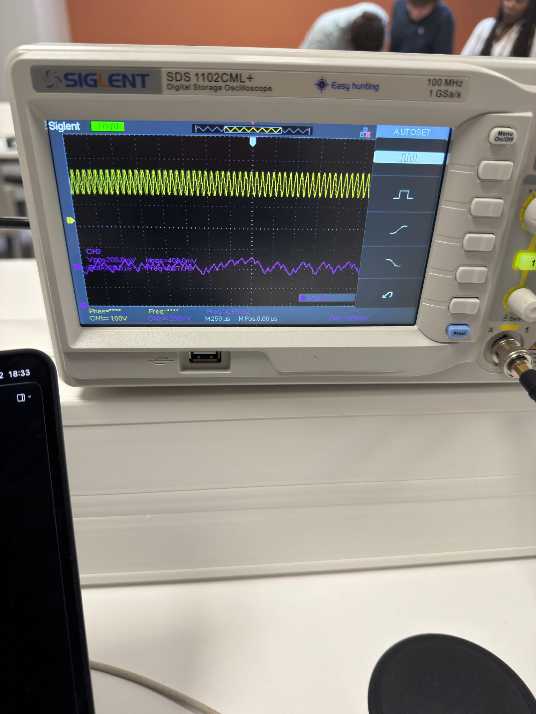

# Démo Nyquist : à Fe/2, la reconstruction s'effondre

**Test pédagogique** : injection d'un signal **à 16 kHz** = limite théorique de Nyquist.

- CH1 (entrée brute) — toujours bien présent
- CH2 (reconstruction DAC) — **plus reconnaissable**, amplitude divisée par 5

À la limite, 2 échantillons par période ne suffisent **plus** à capturer la phase.

 

**Conclusion :** un signal au-dessus de 4 kHz dans la bande utile (après décimation /4) **se replie** dans la voix.

→ **Justifie la nécessité du filtre FP2.**

::right::

Injection 16 kHz : CH1 préservé, 
CH2 (DAC) chaotique — Vpp 208 mV

