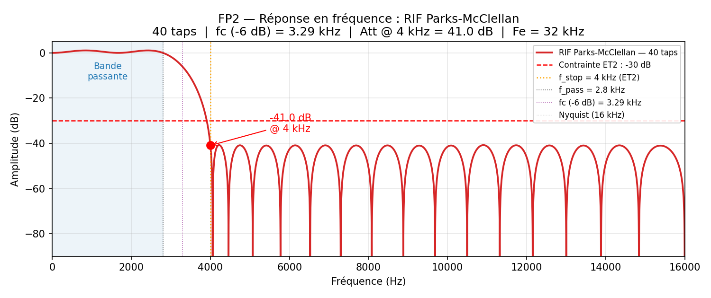

# FP2 — RIF Parks-McClellan, 40 taps optimaux

**Méthode retenue** — Parks-McClellan equiripple (T-Filter)

Optimal au sens « plus petit ordre pour un gabarit donné » → **40 taps** (vs 97 avec méthode des fenêtres).

 

**Gabarit visé**

| Bande | Plage | Critère |
|---|---|---|
| Passante | 0 – 2,8 kHz | gain 1, ripple 1 dB |
| Coupée | 4 – 16 kHz | atténuation **≥ 30 dB** (ET2) |

 

**Résultat théorique**

- Atténuation à 4 kHz : **−41,5 dB**
- Marge sur ET2 : **+11,5 dB**
- Phase linéaire (coefs symétriques)

::right::

Réponse en fréquence du RIF 40 taps. 
Le seuil ET2 (−30 dB, ligne rouge) est franchi avec ≥ 11 dB de marge.

