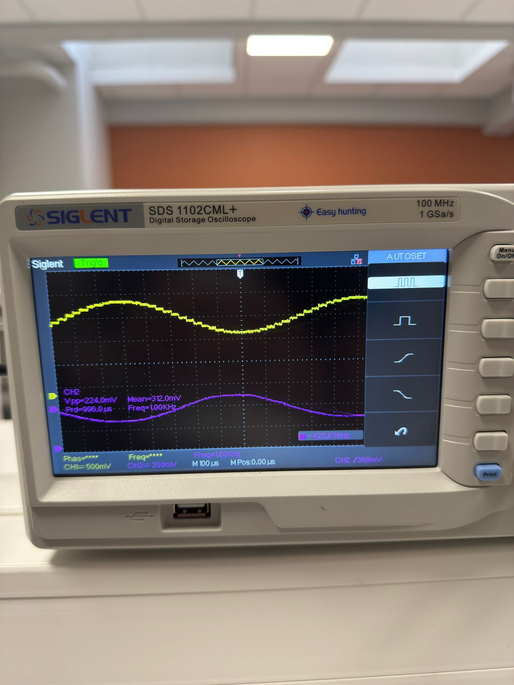
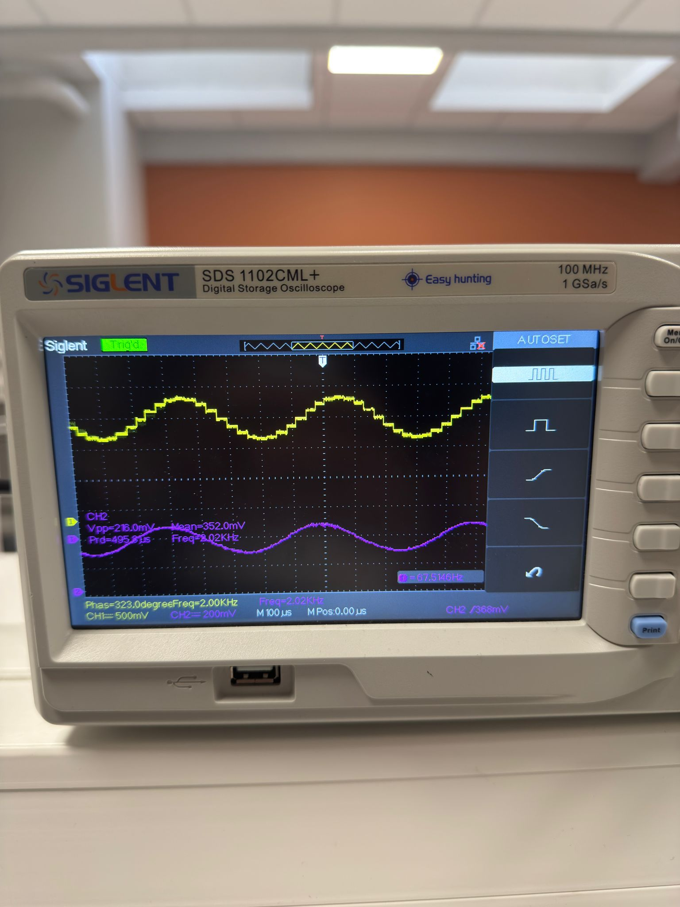
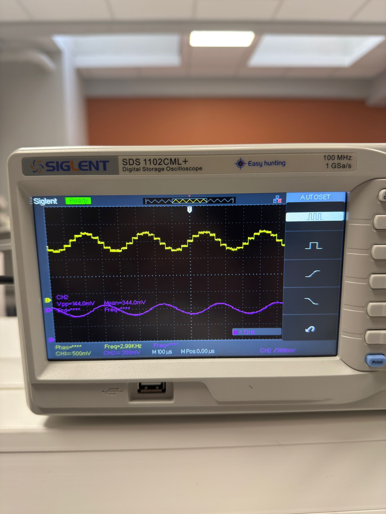
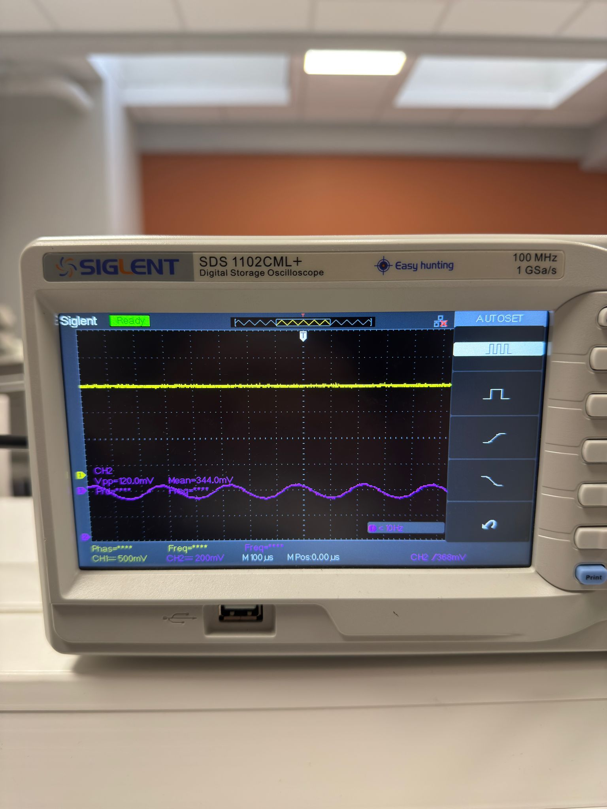

# ET2 démontrée à l'oscilloscope (DAC0 vs DAC1)

**1 kHz** — CH1 = CH2 (passe)

**2 kHz** — toujours en bande passante

**3 kHz** — entrée en transition

**4 kHz** — CH2 effondré → ET2 ✓

DAC0 = signal brut (CH1) · DAC1 = signal filtré (CH2) · GBF 1 Vpp sinus

