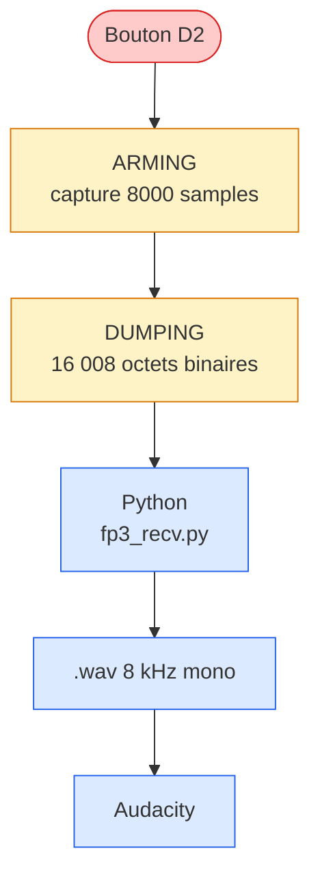

# FP3 — Bouton, capture 1 s, WAV vers Audacity

**Pipeline d'enregistrement**

**Protocole série binaire** : magic header `0xAA55AA55` + uint32 length + 16 000 octets PCM int16 + footer `0xDEADBEEF`.

→ Logs ASCII suspendus pendant DUMPING.

::right::

**ET4 — preuve auditive**

À la lecture du `.wav` dans Audacity :

✓ on **reconnaît** « Électronique » 
✓ 4 syllabes distinctes visibles 
✓ bande utile préservée 0–4 kHz 
✓ pas de saturation, pas de clic

 

**Démo en direct** lors de la présentation : 
appui bouton D2 → script Python 
→ ouverture Audacity → écoute

<code>scripts/fp3_recv.py</code> + <code>src/main.cpp</code> · pyserial requis

