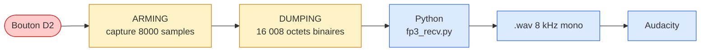

# FP3 — Bouton, capture 1 s, WAV vers Audacity

**Protocole binaire**

Magic header `0xAA55AA55` + uint32 length + 16 000 octets PCM int16 + footer `0xDEADBEEF`.

Logs ASCII suspendus pendant DUMPING pour ne pas polluer le flux.

**ET4 — preuve auditive**

À l'écoute du `.wav` dans Audacity :
- ✓ on **reconnaît** « Électronique »
- ✓ 4 syllabes distinctes
- ✓ bande utile 0–4 kHz préservée
- ✓ pas de saturation, pas de clic

